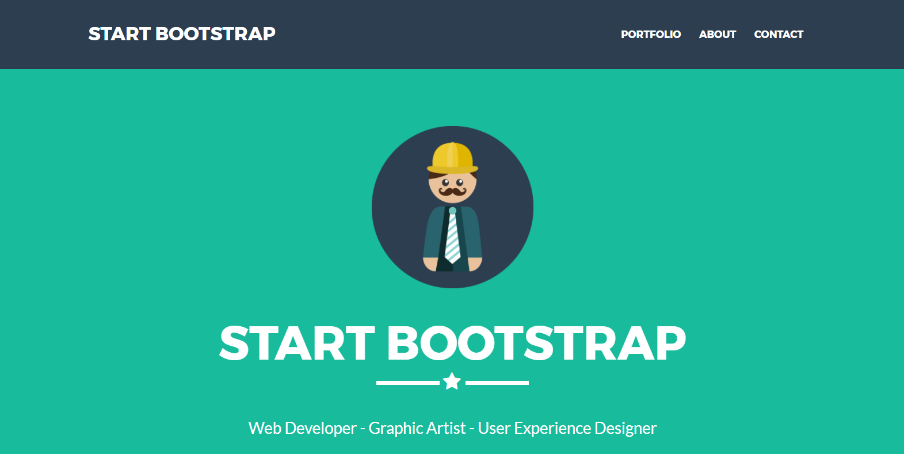
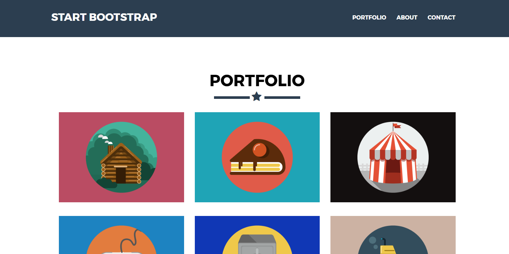
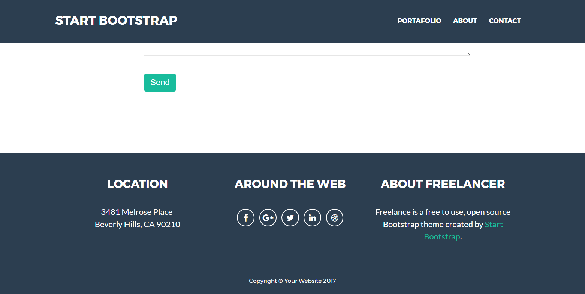

## README
1. **Nombre del proyecto:**
	- Freelancer
2. **Autor:**
	- Lilliam Haro (8BM)
3. **Descripción del Proyecto:**
	- Este proyecto contiene la maquetación de la página web Freelancer [ver página original](https://blackrockdigital.github.io/startbootstrap-freelancer/)
4. **Herramientas utilizadas:**
	- HTML5
	- CSS3
  - Google fonts
  - Font-awesome
5. Resultados Finales
	 *Primera vista de la página*
	
  *Vista de la página al hacer scroll*
	
	*Vista final de la página*
	
