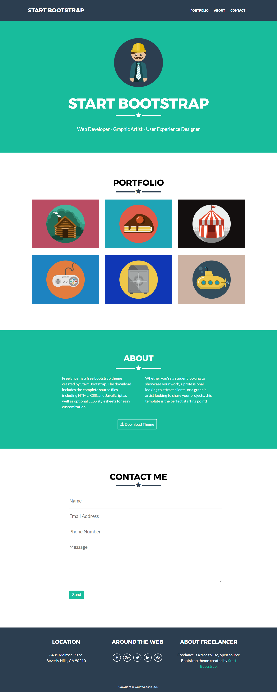

## README
1. **Nombre del proyecto:**
	- Freelancer
2. **Autor:**
	- Lilliam Haro (8BM)
3. **Descripción del Proyecto:**
	- Este proyecto contiene la maquetación de la página web Freelancer [ver página original](https://blackrockdigital.github.io/startbootstrap-freelancer/)
4. **Herramientas utilizadas:**
	- HTML5
	- CSS3
  - Google fonts
  - Font-awesome
5. **Resultados Finales:**
	
